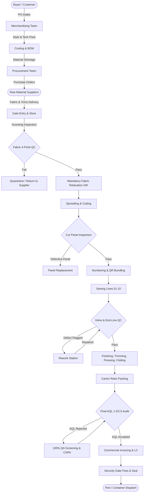
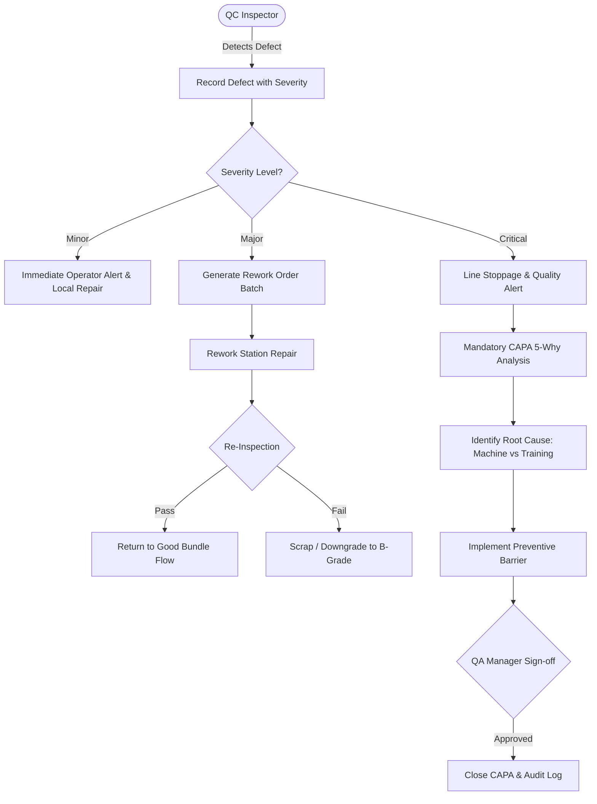
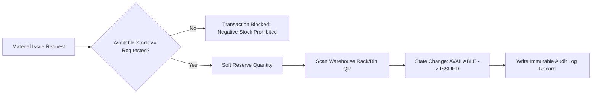

# Garment Manufacturing Lifecycle & Workflows
## GarmentERP BD — End-to-End Operational Workflows

This document illustrates the operational lifecycles embedded inside **GarmentERP BD**, showing how departments coordinate without data silos.

---

## 1. Global Order-to-Shipment Journey

---

## 2. QA/QC Defect, Rework & CAPA Escalation Flow

---

## 3. Warehouse Negative Inventory Prevention Architecture

